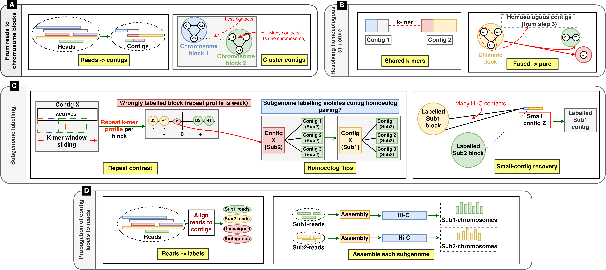

# PolySplit-Allo

Reference-free subgenome separation of allopolyploid long reads by assembly-first
homoeolog phasing. This repository accompanies the submitted manuscript and is provided
for review.

<p align="center"></p>

## Layout
- `pipeline/`  core PolySplit stages
  - `homoeolog_graph_from_lcp.py`  shared-33mer homoeolog edges from a gsufsort GSA+LCP
  - `dechimerize_structural.py`    Hi-C blocks + structural de-chimerization (imports `decloud_blocks_v2.py`)
  - `label_small_contigs_v2.py`    repeat-composition contrast labelling + small-contig recovery
  - `homoeolog_repair.py`          homoeolog-consistency repair
  - `propagate_to_reads.py`        identity-weighted contig-label -> read propagation
  - `allread_eval.py`, `eval_contig_labels.py`  read- and contig-level evaluation
- `refguided/`  reference-guided signature baseline (K=2 and K=3)
- `drivers/`    end-to-end driver scripts, one per dataset (PolySplit, reference-guided, timing)
- `baselines/`  wrappers + cluster-to-subgenome mapping + read-eval for the comparison methods
  - `polycracker/{napus,tetraploid,hexaploid}/`  run polyCRACKER, map clusters to subgenomes (best 1:1), score
  - `subphaser/{napus,tetraploid,hexaploid}/`     YaHS scaffold + SubPhaser (scaffold-first), score
  These call the external tools polyCRACKER and SubPhaser, which must be installed separately.

## Dependencies
Python 3 (numpy, scikit-learn, networkx) and the external tools Flye, bwa, samtools,
minimap2, gsufsort (32- and 64-bit builds), KMC, YaHS, and SubPhaser (baseline only).

## Running
Paths in the drivers are placeholders (`$DATA`, `$POLYSPLIT`, `$SUBPHASER`, `$FLYE_BIN`).
Set them in `config.sh` for your environment and `source` it, then run a driver, e.g.:
```
source config.sh
bash drivers/run_polysplit_nam0.sh
```
Each driver is idempotent: every stage skips if its output already exists.

## Data
Sequencing inputs and the evaluation reference are not redistributed here; see the
manuscript's data-availability statement for accessions.
