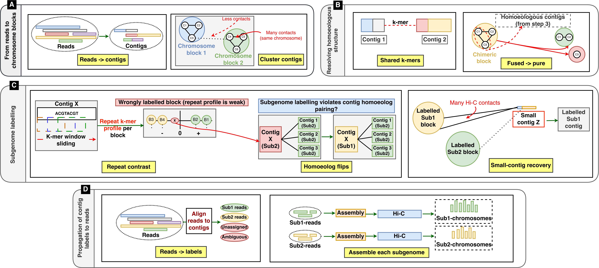

# PolySplit-Allo

Reference-free subgenome separation of allopolyploid long reads by assembly-first
homoeolog phasing. This repository accompanies the submitted manuscript and is provided
for review.

<p align="center"></p>

## Layout
- `pipeline/`  core PolySplit stages
  - `homoeolog_graph_from_lcp.py`  shared-33mer homoeolog edges from a gsufsort GSA+LCP
  - `dechimerize_structural.py`    Hi-C blocks + structural de-chimerization (imports `decloud_blocks_v2.py`)
  - `label_small_contigs_v2.py`    repeat-composition contrast labelling + small-contig recovery
  - `homoeolog_repair.py`          homoeolog-consistency repair
  - `propagate_to_reads.py`        identity-weighted contig-label -> read propagation
  - `allread_eval.py`, `eval_contig_labels.py`  read- and contig-level evaluation
- `refguided/`  reference-guided signature baseline (K=2 and K=3)
- `drivers/`    `run_polysplit.sh` (generalized: `--type ont|hifi`, `--nsg K`) and `run_separated_assembly.sh`; plus per-dataset scripts that reproduce the paper runs (PolySplit, reference-guided, sensitivity, timing)
- `baselines/`  wrappers + cluster-to-subgenome mapping + read-eval for the comparison methods
  - `polycracker/{napus,tetraploid,hexaploid}/`  run polyCRACKER, map clusters to subgenomes (best 1:1), score
  - `subphaser/{napus,tetraploid,hexaploid}/`     YaHS scaffold + SubPhaser (scaffold-first), score
  These call the external tools polyCRACKER and SubPhaser, which must be installed separately.
- `readdirect/`  assembly-free control: cluster raw reads by single-copy k-mer incidence and score vs truth (shows the assembly step is necessary)

## Dependencies
Python 3 (numpy, scikit-learn, networkx) and the external tools Flye, bwa, samtools,
minimap2, gsufsort (32- and 64-bit builds), KMC, YaHS, and SubPhaser (baseline only).

## Usage
Inputs: pooled long reads (one FASTQ), a Hi-C/Omni-C read pair, and the number of subgenomes
`K`. No reference genome is needed to run the tool; a reference is only used to score accuracy.

**1. Configure.** Edit `config.sh` to point `DATA`, `POLYSPLIT`, and `FLYE_BIN` at your
environment (`SUBPHASER` and `KMC_BIN` are only needed for the baselines and the read-direct
control), then source it:
```
source config.sh
```

**2. Separate the reads into subgenomes.**
```
bash drivers/run_polysplit.sh \
     --reads reads.fq.gz --hic1 hic_R1.fq.gz --hic2 hic_R2.fq.gz \
     --type ont --nsg 2 --work out/
```
- `--type`  `ont` (Flye `--nano-hq`, minimap `map-ont`) or `hifi` (`--pacbio-hifi`, `map-hifi`)
- `--nsg`   number of subgenomes to separate (2 for a tetraploid, 3 for a hexaploid)
- `--work`  output directory
- `--flye-preset nano-raw`  optional; overrides the default assembly preset

This runs the full pipeline (assemble -> Hi-C blocks -> homoeolog pairing -> subgenome
labelling -> propagate) and writes per-read subgenome labels to `out/read_subg.tsv`.

**3. Assemble each subgenome (optional).**
```
bash drivers/run_separated_assembly.sh \
     --labels out/read_subg.tsv --reads reads.fq.gz \
     --type ont --work out/ --hic1 hic_R1.fq.gz --hic2 hic_R2.fq.gz
```
Splits the reads by label, assembles each subgenome with Flye, scaffolds with YaHS, and writes
`out/sep_asm/summary.tsv` (size, contigs, N50, read back-mapping rate, subgenome purity).

**Scoring accuracy (benchmarking only).** Add `--ref REF.fa --chrom-subg map.tsv` to either
command, where `map.tsv` is two columns, chromosome and its subgenome (`chrom<TAB>subgenome`).
`run_polysplit.sh` then also reports read-level accuracy, precision, recall, and F1.

**Reproducing the paper.** The per-dataset `drivers/run_polysplit_<name>.sh` scripts run the
exact commands (paths and presets) used for each dataset in the manuscript. The tetraploid and
NAM0 ONT runs used `--nano-raw`, reproducible with `run_polysplit.sh ... --flye-preset nano-raw`.

Every stage is idempotent: re-running skips any stage whose output already exists.

## Data
Sequencing inputs and the evaluation reference are not redistributed here; see the
manuscript's data-availability statement for accessions.
