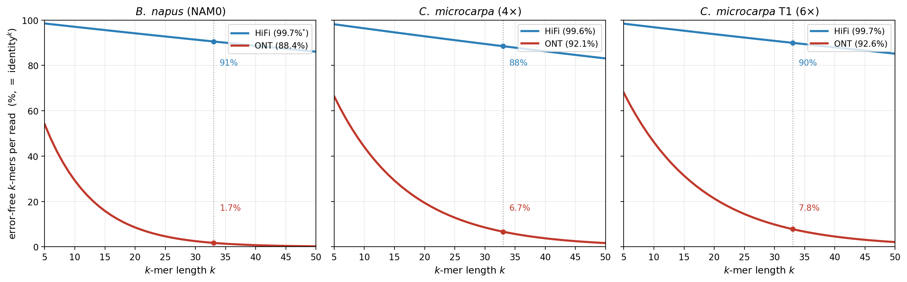
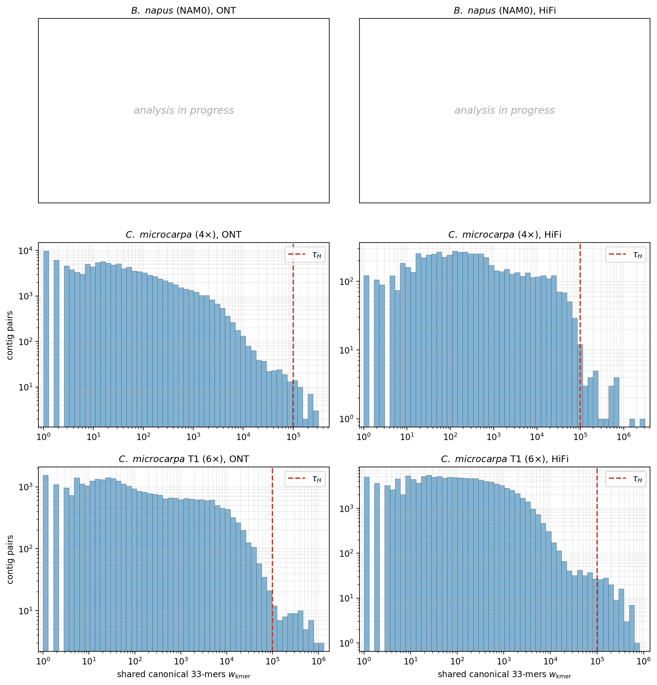
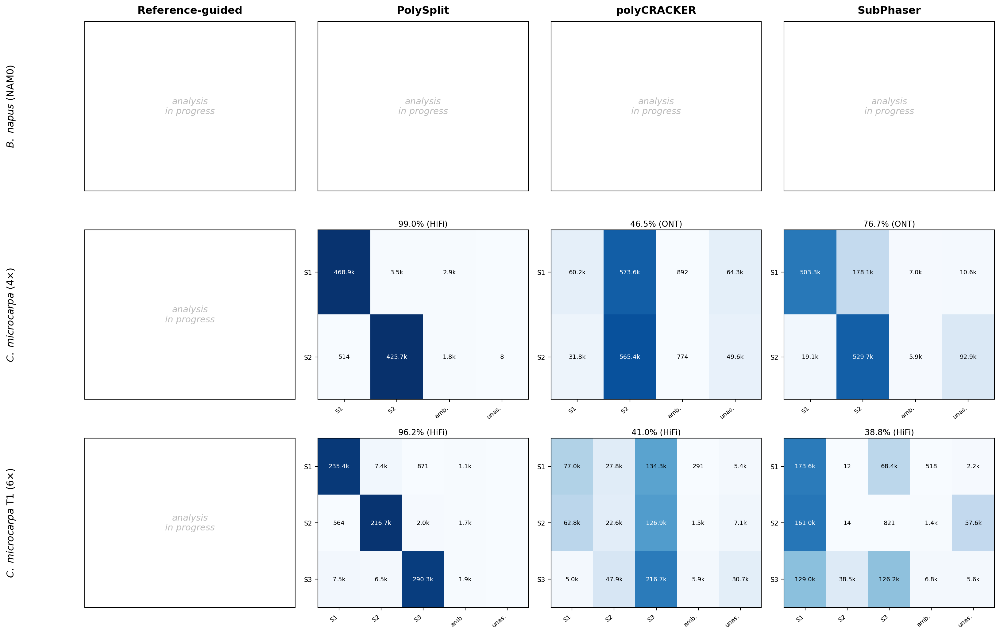

# PolySplit-Allo — Supplementary Materials

This page hosts the supplementary material linked from the manuscript. Supplementary figure and
table numbering follows the manuscript order (Figures S1–S4, Tables S1–S4). Figures live in
`figures/`; place the pristine PNGs there (do not pass them through any text processor).

## Supplementary Figures

### Figure S1. The full PolySplit pipeline

*Caption.* Step-by-step schematic expanding the four stages summarized in main-text Fig. 2.
**(A)** Mixed long reads are assembled with Flye and the contigs are clustered into Hi-C blocks by
length-normalized contact density and Louvain community detection. **(B)** A generalized suffix
array and LCP array over the contigs yield shared canonical 33-mer counts; strong edges
(> data-derived cutoff $\tau_H$) pair homoeologous blocks, and a strong edge *within* a block flags
a chromosome-with-homoeolog fusion that is split by re-clustering the block's own Hi-C subgraph.
**(C)** Per-block repeat-15-mer composition vectors are contrasted along the leading homoeolog-pair
difference axis to assign subgenomes; a homoeolog-consistency repair flips contigs whose strong
homoeologs share their label, and small contigs left out of blocks are recovered by Hi-C linkage.
**(D)** Reads are realigned to the labelled contigs and assigned by identity-weighted voting; each
subgenome is then assembled and Hi-C-scaffolded independently, so homoeologs are never fused.

### Figure S2. Exact k-mer survival on raw reads, per dataset

*Caption.* Fraction of a read's $k$-mers that are error-free (per-base identity raised to the
$k$-th power) versus $k$, shown separately for each dataset's ONT and HiFi reads. Per-base identity
is measured from each read set's alignment to its reference (minimap2 `de` tag). At $k=33$, the
homoeolog-pairing length, exact $k$-mers survive on HiFi (88–91%) but largely collapse on ONT
(1.7–7.8%, lowest on the ~88%-accurate *B. napus* reads). This is why PolySplit assembles the reads
before any exact-$k$-mer analysis: assembly restores the exact $k$-mer structure that raw ONT reads
lack, so the method is robust to read chemistry. $^{*}$The NAM0 HiFi value is the chemistry-typical
~99.7% (its HiFi run is in progress) and will be replaced with the measured identity.

### Figure S3. Homoeolog shared-33-mer edge-weight distributions, per dataset and chemistry

*Caption.* Distribution of the number of shared canonical 33-mers between contig pairs,
$w_{\mathrm{kmer}}(a,b)$, for each dataset (rows) and read chemistry (columns). In every panel the
genuine homoeologs share long sequence tracts and occupy the extreme upper tail, well separated
from the background of incidental matches; the strong-edge cutoff $\tau_H$ (dashed line) retains the
upper-tail edges as homoeolog links, and is read off this distribution rather than tuned on truth
labels. The more contiguous HiFi assemblies push the homoeolog tail to higher $w_{\mathrm{kmer}}$.
The *B. napus* (NAM0) panels are left blank pending its assembly runs.

### Figure S4. Read-level confusion matrices across methods and species

*Caption.* Rows are the three allopolyploids; columns are the four methods, with PolySplit shown at
its best chemistry (HiFi here). Within each panel, rows are the true subgenome and columns the
predicted label (subgenomes, ambiguous, unassigned); each cell gives the number of reads (the cell
colour is the row fraction, so the diagonal stands out), and the panel header gives the read
accuracy and chemistry. For the methods that
emit unlabelled clusters (polyCRACKER, SubPhaser), clusters are mapped to subgenomes by the best
one-to-one assignment to truth. **PolySplit** concentrates on the diagonal (99.0% tetraploid,
96.2% hexaploid, using no reference), whereas **polyCRACKER** collapses the subgenomes into a single
cluster (46.5%, 41.0%) and **SubPhaser** leaks or scrambles them (76.7%, 38.8%). The reference-guided
panels and the entire *B. napus* (NAM0) row are left blank pending those runs.

## Supplementary Tables

### Table S1. Assembly size at each stage (Mb, % of reference)
Mixed Flye = single assembly of all pooled reads (input to PolySplit and the baselines);
separated = per-subgenome assembly produced after PolySplit partitions the reads; reference =
placed-chromosome size.

| Genome | reads | mixed Flye | separated (Σ subgenomes) | reference |
|---|---|---|---|---|
| *B. napus* NAM0 | ONT | _[pending]_ | _[pending]_ | 1008 |
| *B. napus* NAM0 | HiFi | _[pending]_ | _[pending]_ | 1008 |
| *C. microcarpa* (4×) | ONT | 365 | _[pending]_ | 384 |
| *C. microcarpa* (4×) | HiFi | _[pending]_ | _[pending]_ | 384 |
| *C. microcarpa* T1 (6×) | ONT (`--nano-hq`) | ~592 | _[pending]_ | 608 |
| *C. microcarpa* T1 (6×) | HiFi | 591 | _[pending]_ | 608 |

### Table S2. Per-subgenome precision, recall, and F1
Breakdown of the macro-averaged values in main Table III. Abbreviations: P, precision; R, recall;
F1, harmonic mean of P and R (per subgenome). Ambiguous/unassigned reads count as missed (lower R)
but are never false positives.

| Genome | reads | subgenome | P | R | F1 |
|---|---|---|---|---|---|
| *B. napus* NAM0 | ONT | A | _[pending]_ | _[pending]_ | _[pending]_ |
| *B. napus* NAM0 | ONT | C | _[pending]_ | _[pending]_ | _[pending]_ |
| *C. microcarpa* (4×) | ONT | S1 | _[ ]_ | _[ ]_ | 97.8 |
| *C. microcarpa* (4×) | ONT | S2 | _[ ]_ | _[ ]_ | 97.8 |
| *C. microcarpa* T1 (6×) | ONT (`--nano-hq`) | S1 | 99.6 | 88.7 | _[ ]_ |
| *C. microcarpa* T1 (6×) | ONT (`--nano-hq`) | S2 | 85.6 | 96.5 | _[ ]_ |
| *C. microcarpa* T1 (6×) | ONT (`--nano-hq`) | S3 | 99.1 | 92.1 | _[ ]_ |

### Table S3. Subgenome-resolved assembly quality
Separated assemblies versus the reference: total size, contig count, N50, BUSCO completeness and
duplication, read back-mapping rate, and reference-aligned subgenome purity (the fraction of each
assembly that maps to its intended subgenome rather than its homoeolog). _[pending: assemblies in
progress]_

| Assembly | size (Mb) | N50 | BUSCO C/D | back-map | purity |
|---|---|---|---|---|---|
| _[pending]_ | | | | | |

### Table S4. Parameter sensitivity
Read accuracy under variation of each fixed threshold around its default, holding the others fixed;
defaults in **bold**. Demonstrates that no result hinges on a tuned value. _[pending: sweep to run]_

| Parameter | values tested | read accuracy |
|---|---|---|
| signature copy cap $f_{\max}$ | 2 / **3** / 5 | _[pending]_ |
| min signature hits $t$ | 2 / **3** / 5 | _[pending]_ |
| dominance ratio $\rho$ | 2 / **3** / 4 | _[pending]_ |
| block floor (Mb) | 1 / **3** / 5 | _[pending]_ |
| recovery floor $\alpha$ | 0.50 / **0.55** / 0.60 | _[pending]_ |
| read confidence $\beta$ | 0.55 / **0.60** / 0.65 | _[pending]_ |

## Data and Code Availability
- **Sequencing data.** *Camelina microcarpa* reads and assemblies: EBI-ENA accession PRJEB96055;
  assemblies at the public crucifer-genome repository. *B. napus* NAM0 (line N99): see the
  manuscript data-availability statement.
- **Code.** All PolySplit and baseline scripts are in this repository (`pipeline/`, `refguided/`,
  `drivers/`, `baselines/`); see `README.md`.
