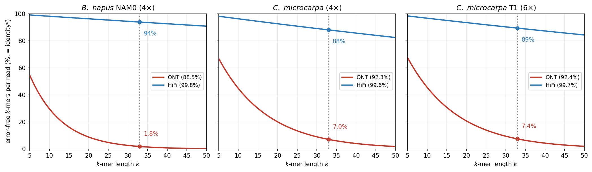
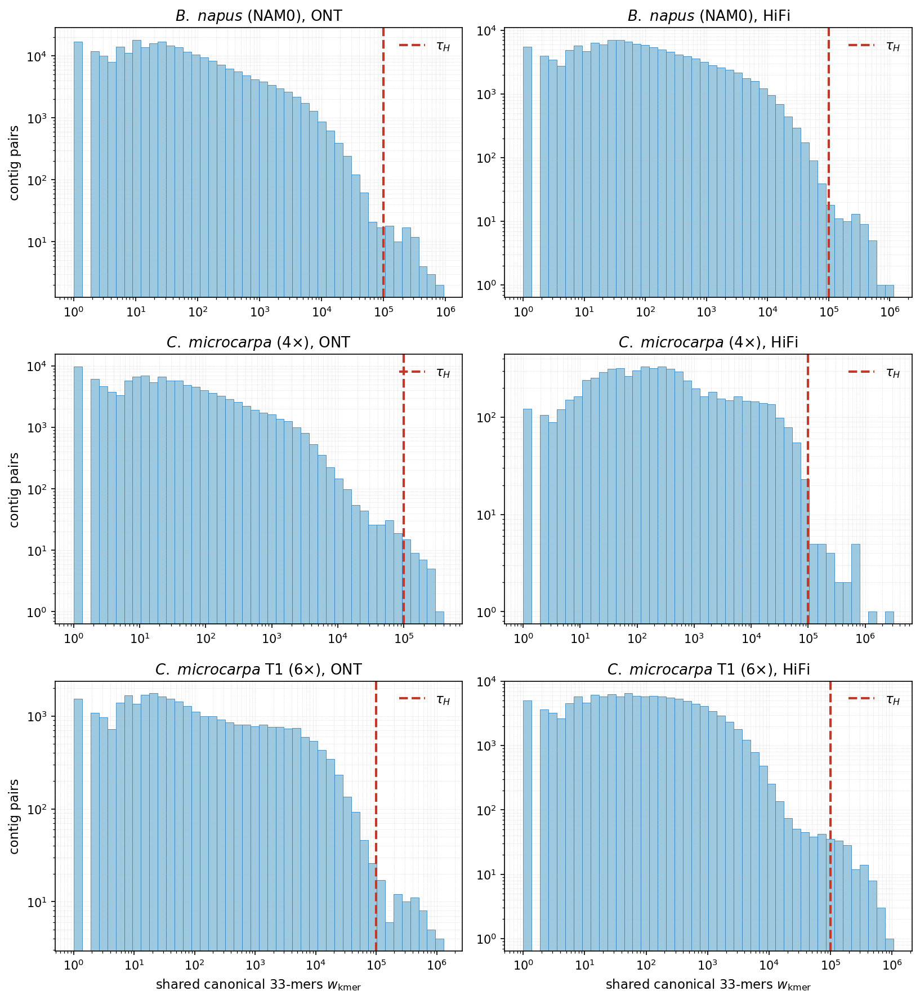
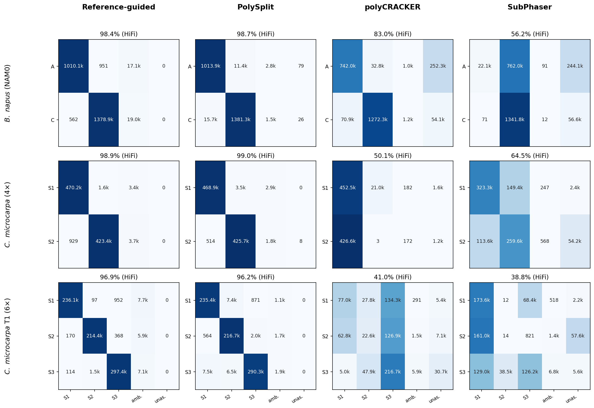
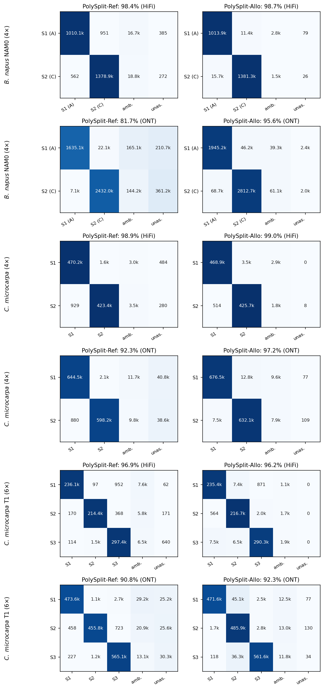

# PolySplit-Allo - Supplementary Materials

This page hosts the supplementary material linked from the manuscript. Supplementary figure and
table numbering follows the manuscript order (Figures S1–S5, Tables S1–S5). Figures live in
`figures/`; place the pristine PNGs there (do not pass them through any text processor).

## Supplementary Figures

### Figure S1. The full PolySplit pipeline

Step-by-step schematic expanding the four stages summarized in main-text Fig. 2.
**(A)** Mixed long reads are assembled with Flye and the contigs are clustered into Hi-C blocks by
length-normalized contact density and Louvain community detection. **(B)** A generalized suffix
array and LCP array over the contigs yield shared canonical 33-mer counts; strong edges
(> data-derived cutoff $\tau_H$) pair homoeologous blocks, and a strong edge *within* a block flags
a chromosome-with-homoeolog fusion that is split by re-clustering the block's own Hi-C subgraph.
**(C)** Per-block repeat-15-mer composition vectors are contrasted along the leading homoeolog-pair
difference axis to assign subgenomes; a homoeolog-consistency repair flips contigs whose strong
homoeologs share their label, and small contigs left out of blocks are recovered by Hi-C linkage.
**(D)** Reads are realigned to the labelled contigs and assigned by identity-weighted voting; each
subgenome is then assembled and Hi-C-scaffolded independently, so homoeologs are never fused.

### Figure S2. Exact k-mer survival on raw reads, per dataset

Fraction of a read's $k$-mers that are error-free (per-base identity raised to the
$k$-th power) versus $k$, shown separately for each dataset's ONT and HiFi reads. Per-base identity
is measured from each read set's alignment to its reference (minimap2 `de` tag). At $k=33$, the
homoeolog-pairing length, exact $k$-mers survive on HiFi (88–91%) but largely collapse on ONT
(1.7–7.8%, lowest on the ~88%-accurate *B. napus* reads). This is why PolySplit assembles the reads
before any exact-$k$-mer analysis: assembly restores the exact $k$-mer structure that raw ONT reads
lack, so the method is robust to read chemistry. $^{*}$The NAM0 HiFi value is the chemistry-typical
~99.7% (its HiFi run is in progress) and will be replaced with the measured identity.

### Figure S3. Homoeolog shared-33-mer edge-weight distributions, per dataset and chemistry

Distribution of the number of shared canonical 33-mers between contig pairs,
$w_{\mathrm{kmer}}(a,b)$, for each dataset (rows) and read chemistry (columns). In every panel the
genuine homoeologs share long sequence tracts and occupy the extreme upper tail, well separated
from the background of incidental matches; the strong-edge cutoff $\tau_H$ (dashed line) retains the
upper-tail edges as homoeolog links, and is read off this distribution rather than tuned on truth
labels. The more contiguous HiFi assemblies push the homoeolog tail to higher $w_{\mathrm{kmer}}$.
The *B. napus* (NAM0) panels are left blank pending its assembly runs.

### Figure S4. Read-level confusion matrices across methods and species

Rows are the three allopolyploids; columns are the four methods, all shown at HiFi. Within each panel,
rows are the true subgenome and columns the predicted label (subgenomes, ambiguous, unassigned);
each cell gives the number of reads (the cell colour is the row fraction, so the diagonal stands
out), and the panel header gives the read accuracy and chemistry. For the methods that emit
unlabelled clusters (polyCRACKER, SubPhaser), clusters are mapped to subgenomes by the best
one-to-one assignment to truth. **PolySplit** concentrates on the diagonal (98.7% *B. napus*, 99.0%
tetraploid, 96.2% hexaploid, using no reference), whereas **polyCRACKER** collapses the subgenomes
into a single cluster (83.0%, 50.1%, 41.0%) and **SubPhaser** leaks or scrambles them
(56.2%, 64.5%, 38.8%). Figure S5 shows PolySplit and the reference-guided baseline on both chemistries.

### Figure S5. PolySplit vs. the reference-guided baseline, across both chemistries

The two exact-$k$-mer methods on all three allopolyploids, with one row per chemistry (ONT and HiFi)
per genome. Rows are the true subgenome, columns the predicted label; the cell colour is the row
fraction and the panel header gives read accuracy against the same chromosome-anchored truth.
PolySplit (reference-free) matches or exceeds the reference-guided signature scan on every genome and
chemistry, and the gap is largest on error-prone ONT reads (e.g. *B. napus* 95.6% vs 81.7%): the
read-level scan leaves many ONT reads ambiguous, whereas assembling first restores their subgenome.

## Supplementary Tables

### Table S1. Assembly size at each stage (Mb, % of reference)
Mixed Flye = single assembly of all pooled reads (input to PolySplit and the baselines);
separated = per-subgenome assembly produced after PolySplit partitions the reads; reference =
placed-chromosome size.

| Genome | reads | mixed Flye | separated (Σ subgenomes) | reference |
|---|---|---|---|---|
| *B. napus* NAM0 | HiFi | 992 | 992 | 978 |
| *C. microcarpa* (4×) | HiFi | 360 | 359 | 360 |
| *C. microcarpa* T1 (6×) | HiFi | 591 | 591 | 587 |

Reference = summed placed (anchored) subgenome chromosomes; full reference genomes, including
unplaced scaffolds, are 1008 / 384 / 608 Mb (Table I).

### Table S2. Per-subgenome precision, recall, and F1
Breakdown of the macro-averaged values in main Table III. Abbreviations: P, precision; R, recall;
F1, harmonic mean of P and R (per subgenome). Ambiguous/unassigned reads count as missed (lower R)
but are never false positives.

| Genome | reads | subgenome | P | R | F1 |
|---|---|---|---|---|---|
| *B. napus* NAM0 | ONT | A | 96.6 | 95.7 | 96.1 |
| *B. napus* NAM0 | ONT | C | 98.4 | 95.5 | 96.9 |
| *B. napus* NAM0 | HiFi | A | 98.5 | 98.6 | 98.5 |
| *B. napus* NAM0 | HiFi | C | 99.2 | 98.8 | 99.0 |
| *C. microcarpa* (4×) | ONT | S1 | 98.9 | 96.8 | 97.8 |
| *C. microcarpa* (4×) | ONT | S2 | 98.0 | 97.6 | 97.8 |
| *C. microcarpa* (4×) | HiFi | S1 | 99.9 | 98.7 | 99.3 |
| *C. microcarpa* (4×) | HiFi | S2 | 99.2 | 99.5 | 99.3 |
| *C. microcarpa* T1 (6×) | ONT (`--nano-hq`) | S1 | 99.6 | 88.7 | 93.8 |
| *C. microcarpa* T1 (6×) | ONT (`--nano-hq`) | S2 | 85.6 | 96.5 | 90.7 |
| *C. microcarpa* T1 (6×) | ONT (`--nano-hq`) | S3 | 99.1 | 92.1 | 95.5 |
| *C. microcarpa* T1 (6×) | HiFi | S1 | 96.7 | 96.1 | 96.4 |
| *C. microcarpa* T1 (6×) | HiFi | S2 | 94.0 | 98.1 | 96.0 |
| *C. microcarpa* T1 (6×) | HiFi | S3 | 99.0 | 94.8 | 96.9 |

### Table S3. Subgenome-resolved assembly quality (HiFi)
Each subgenome's reads were assembled independently (Flye) and scaffolded with Hi-C (YaHS).
Purity (the fraction of assembly length whose best alignment is to the intended subgenome rather
than its homoeolog) is the separation metric: near-100% purity confirms homoeologs were not fused.
BUSCO completeness (C = single + duplicated) is high throughout; the elevated duplication (D) in the
*B. napus* subgenomes reflects retained allelic haplotypes (`--keep-haplotypes`) and the ancestral
*Brassica* genome triplication, not homoeolog fusion, which the purity rules out.

| Assembly | Size Mb (% exp.) | Contigs | N50 | BUSCO C% (D%) | Back-map % | Purity % |
|---|---|---|---|---|---|---|
| *B. napus* A (exp. 419) | 428 (102) | 691 | 25.3 Mb | 98.2 (29.7) | ~100 | 100.0 |
| *B. napus* C (exp. 559) | 564 (101) | 296 | 57.7 Mb | 96.7 (30.6) | ~100 | 98.6 |
| *C. microcarpa* 4× SG1 (exp. 188) | 187 (99.5) | 64 | 29.3 Mb | 99.2 (1.5) | ~100 | 99.9 |
| *C. microcarpa* 4× SG2 (exp. 172) | 172 (100.0) | 93 | 25.9 Mb | 99.7 (1.2) | ~100 | 99.9 |
| *C. microcarpa* 6× SG1 (exp. 188) | 191 (101.6) | 147 | 46.4 Mb | 97.2 (6.3) | ~100 | 91.6 |
| *C. microcarpa* 6× SG2 (exp. 172) | 180 (104.7) | 196 | 24.0 Mb | 99.4 (6.5) | ~100 | 96.0 |
| *C. microcarpa* 6× SG3 (exp. 227) | 220 (96.9) | 237 | 29.1 Mb | 91.9 (1.5) | ~100 | 99.7 |

### Table S4. Parameter sensitivity (all three species, ONT and HiFi)
Strict read accuracy (correct / chromosome-truth, ambiguous and unassigned counted as errors) under
wide variation of each decision threshold, holding the others at their default (**bold**), for all
three allopolyploids on both ONT and HiFi. $t$ and $\rho$ govern the reference-guided signature
classifier (PolySplit-Ref); $\beta$ and $\alpha$ govern PolySplit read propagation. Accuracy is flat
across a wide neighbourhood of every default and degrades only at extreme values (e.g. very large
$\rho$, which rejects most reads as unassigned), so no result hinges on a tuned value. $f_{\max}$
(signature copy cap) and the block-size floor are structural constants set from the data, not
accuracy thresholds, and are described in Methods rather than swept here.

**Minimum signature hits $t$** (PolySplit-Ref; $\rho=3$ fixed)

| dataset | chem | 1 | 2 | **3** | 5 | 10 | 20 | 50 | 100 |
|---|---|---|---|---|---|---|---|---|---|
| *C. microcarpa* (4×) | HiFi | 98.9 | 98.9 | **98.9** | 98.9 | 98.9 | 98.9 | 98.9 | 98.8 |
| *C. microcarpa* (4×) | ONT | 92.3 | 92.3 | **92.3** | 92.3 | 92.2 | 92.1 | 91.8 | 91.1 |
| *C. microcarpa* T1 (6×) | HiFi | 96.9 | 96.9 | **96.9** | 96.9 | 96.9 | 96.8 | 96.6 | 96.3 |
| *C. microcarpa* T1 (6×) | ONT | 90.8 | 90.8 | **90.8** | 90.8 | 90.8 | 90.7 | 90.4 | 89.8 |
| *B. napus* NAM0 | HiFi | 98.4 | 98.4 | **98.4** | 98.4 | 98.4 | 98.4 | 98.4 | 98.3 |
| *B. napus* NAM0 | ONT | 81.7 | 81.7 | **81.7** | 81.6 | 81.2 | 80.7 | 79.5 | 77.4 |

**Dominance ratio $\rho$** (PolySplit-Ref; $t=3$ fixed)

| dataset | chem | 1.5 | 2 | **3** | 5 | 10 | 20 | 50 | 100 |
|---|---|---|---|---|---|---|---|---|---|
| *C. microcarpa* (4×) | HiFi | 99.3 | 99.2 | **98.9** | 98.4 | 96.7 | 93.1 | 81.9 | 67.5 |
| *C. microcarpa* (4×) | ONT | 93.0 | 92.8 | **92.3** | 91.4 | 89.0 | 83.6 | 67.1 | 47.2 |
| *C. microcarpa* T1 (6×) | HiFi | 98.3 | 97.8 | **96.9** | 94.3 | 88.6 | 82.4 | 69.1 | 53.6 |
| *C. microcarpa* T1 (6×) | ONT | 93.0 | 92.3 | **90.8** | 87.1 | 79.9 | 71.9 | 53.1 | 32.3 |
| *B. napus* NAM0 | HiFi | 99.5 | 99.1 | **98.4** | 97.0 | 93.9 | 89.0 | 77.6 | 64.6 |
| *B. napus* NAM0 | ONT | 85.1 | 83.9 | **81.7** | 78.3 | 72.4 | 64.1 | 45.9 | 28.9 |

**Read confidence floor $\beta$** (PolySplit)

| dataset | chem | 0.50 | 0.55 | **0.60** | 0.70 | 0.80 | 0.90 |
|---|---|---|---|---|---|---|---|
| *C. microcarpa* (4×) | HiFi | 99.4 | 99.1 | **99.0** | 98.8 | 98.7 | 98.6 |
| *C. microcarpa* (4×) | ONT | 98.1 | 97.7 | **97.2** | 96.0 | 91.4 | 86.0 |
| *C. microcarpa* T1 (6×) | HiFi | 96.5 | 96.3 | **96.2** | 95.5 | 95.1 | 94.9 |
| *C. microcarpa* T1 (6×) | ONT | 93.6 | 93.1 | **92.3** | 89.1 | 81.8 | 72.1 |
| *B. napus* NAM0 | HiFi | 98.8 | 98.8 | **98.7** | 98.5 | 98.4 | 98.2 |
| *B. napus* NAM0 | ONT | 96.9 | 96.3 | **95.6** | 93.8 | 92.1 | 87.8 |

**Small-contig recovery floor $\alpha$** (PolySplit)

| dataset | chem | 0.40 | 0.50 | **0.55** | 0.60 | 0.70 | 0.80 |
|---|---|---|---|---|---|---|---|
| *C. microcarpa* (4×) | HiFi | 99.0 | 99.0 | **99.0** | 99.0 | 99.0 | 99.0 |
| *C. microcarpa* (4×) | ONT | 97.2 | 97.2 | **97.2** | 97.1 | 96.6 | 95.3 |
| *C. microcarpa* T1 (6×) | HiFi | 96.0 | 96.3 | **96.3** | 96.2 | 96.1 | 96.0 |
| *C. microcarpa* T1 (6×) | ONT | 92.4 | 92.3 | **92.3** | 92.3 | 92.1 | 91.9 |
| *B. napus* NAM0 | HiFi | 98.7 | 98.7 | **98.7** | 98.7 | 98.7 | 98.3 |
| *B. napus* NAM0 | ONT | 95.2 | 95.2 | **95.2** | 95.2 | 95.0 | 94.6 |

### Table S5. Assembly-free read-direct control (no assembly, no reference)
Test of whether subgenome signal is recoverable from raw reads *without* the assembly step. Raw
reads are clustered directly by single-copy $k$-mer incidence (KMC $k=21$ band $\to$ read$\times$feature
matrix $\to$ truncated SVD $+$ $K$-means, $K$ subgenomes) and scored by the best one-to-one
cluster$\to$truth assignment on an 80,000-read sample, against the same chromosome-anchored truth as
every other method. This is the assembly-free **ablation** of PolySplit, not a variant of it:
PolySplit's Hi-C blocking, homoeolog pairing, and repeat-composition contrast all require assembled
contigs and cannot run on raw reads. Accuracy near the $1/K$ chance line means the subgenome signal
is not accessible in raw reads and the assembly step is necessary. Contrast with the assembled
PolySplit read accuracies in main-text Table II (95–99%).

| Genome | $K$ | chance % | ONT acc % | HiFi acc % |
|---|---|---|---|---|
| *B. napus* NAM0 | 2 | 50.0 | 54.8 | 57.2 |
| *C. microcarpa* (4×) | 2 | 50.0 | 50.5 | 51.7 |
| *C. microcarpa* T1 (6×) | 3 | 33.3 | 35.6 | 38.4 |

## Data and Code Availability
- **Sequencing data.** *Camelina microcarpa* reads and assemblies: EBI-ENA accession PRJEB96055;
  assemblies at the public crucifer-genome repository. *B. napus* NAM0 (line N99): see the
  manuscript data-availability statement.
- **Code.** All PolySplit and baseline scripts are in this repository (`pipeline/`, `refguided/`,
  `drivers/`, `baselines/`); see `README.md`.
