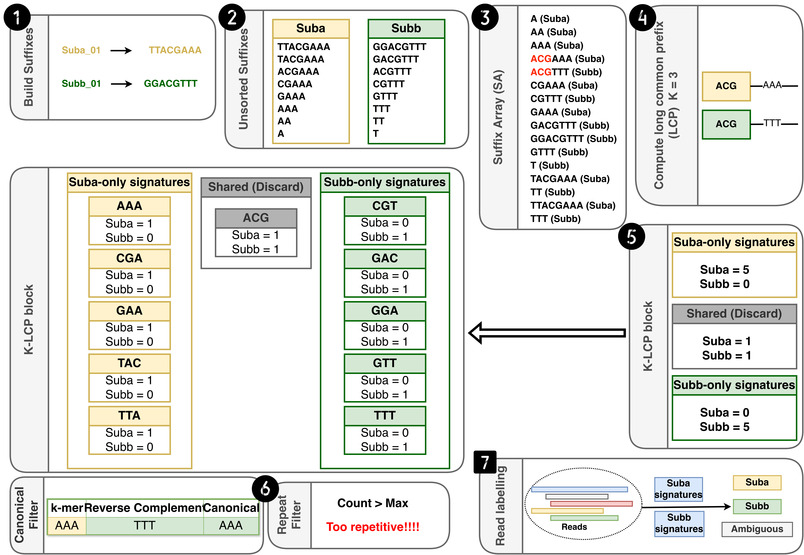

# PolySplit-Allo - Supplementary Materials

This page hosts the supplementary material linked from the manuscript. Supplementary figure and
table numbering follows the manuscript order (Figures S1–S6, Tables S1–S13). Figures live in
`figures/`; place the pristine PNGs there (do not pass them through any text processor).

## Abbreviations and terms
- **ONT**, Oxford Nanopore Technologies long reads; **HiFi**, PacBio high-fidelity (circular consensus) long reads.
- **Hi-C**, chromosome conformation capture followed by sequencing: each read pair joins two DNA fragments that were close together in the nucleus. **Omni-C** is a Hi-C variant that cuts chromatin with a sequence-independent nuclease instead of a restriction enzyme; both give the same kind of contact read pairs and are called Hi-C here.
- **Homoeologs**, the corresponding chromosomes (or genes) that the subgenomes inherited from their different progenitor species; **homologs** are the two copies of one chromosome within a subgenome.
- **K**, number of subgenomes (a required input; 2 for the tetraploids, 3 for the hexaploid); **k**, k-mer length. Subgenomes are named **S1…SK**: *B. napus* S1 = A (N1–N10), S2 = C (N11–N19); *C. microcarpa* S1–S3 = SG1 (Chr01–06), SG2 (Chr07–13), SG3 (Chr14–20). PolySplit-Allo outputs anonymous groups that are matched to S1…SK only for evaluation.
- **Hi-C block**, a group of contigs joined by Louvain clustering of the length-normalized Hi-C contact graph; a block usually covers one chromosome or part of one, but it is not assumed to be a chromosome.
- **Ambiguous** read: evidence for at least one subgenome, but the decision rule is not met (PolySplit-Ref: signature hits but Eq. 2 fails; PolySplit-Allo and baselines: the top subgenome holds less than β of the alignment weight). **Unassigned** read: no usable evidence (PolySplit-Ref: no signature hit, including reads under 2 kb, which are not scanned; PolySplit-Allo and baselines: no alignment to a labelled contig). Both count as errors.
- **MAPQ**, mapping quality; **LCP**, longest common prefix (array); **GSA**, generalized suffix array; **SVD**, singular value decomposition; **AUC**, area under the receiver operating characteristic (ROC) curve; **N50**, the length such that sequences of this length or longer hold half of all bases; **BUSCO**, Benchmarking Universal Single-Copy Orthologs; **ENA**, European Nucleotide Archive; **PAF**, pairwise mapping format.

## Supplementary Figures

### Figure S1. PolySplit-Ref: reference-guided signature extraction

A generalized suffix array and LCP array are built over the two subgenome sequences (panels 1–4; toy
example $k=3$, real $k=33$), grouping identical $k$-mers with the subgenome(s) in which each occurs.
$k$-mers shared by both subgenomes are discarded, leaving disjoint per-subgenome signature sets
(panel 5); each $k$-mer is then canonicalized (merged with its reverse complement) and high-copy
$k$-mers are removed by the repeat filter (panel 6). Each read is scanned and its canonical $k$-mers
matched to the sets; a decision rule (minimum hits $t$, dominance ratio $\rho$) labels the read as one
subgenome or ambiguous (panel 7). This is the reference-guided upper-bound baseline (PolySplit-Ref,
Methods §II-B); it is not part of the reference-free PolySplit-Allo workflow.

### Figure S2. The full PolySplit pipeline

Step-by-step schematic expanding the four stages summarized in main-text Fig. 1.
**(A)** Mixed long reads are assembled with Flye and the contigs are clustered into Hi-C blocks by
length-normalized contact density and Louvain community detection. **(B)** A generalized suffix
array and LCP array over the contigs yield shared 33-mer counts; strong edges
(≥ data-derived cutoff $\tau_H$, and at least half as strong as the strongest edge of each of the two contigs) pair homoeologous blocks, and a strong edge *within* a block flags
a chromosome-with-homoeolog fusion that is split by re-clustering the block's own Hi-C subgraph.
**(C)** Per-block repeat-15-mer composition vectors are contrasted along the leading homoeolog-pair
difference axis to assign subgenomes; a homoeolog-consistency repair flips contigs whose strong
homoeologs share their label, and small contigs left out of blocks are recovered by Hi-C linkage.
**(D)** Reads are realigned to the labelled contigs and assigned by identity-weighted voting; each
subgenome is then assembled and Hi-C-scaffolded independently, so homoeologs are never fused.

### Figure S3. Exact k-mer survival on raw reads, per dataset

Fraction of a read's $k$-mers that are error-free (per-base identity raised to the $k$-th power) versus $k$, for each dataset's ONT and HiFi reads. Per-base identity is the mean of 1 − `de` (minimap2 gap-compressed divergence) over the primary alignments of each read set to its reference. At $k=33$, the homoeolog-pairing length, exact $k$-mers survive on HiFi (88–94%) but largely collapse on ONT (1.8–7.4%, lowest on the ~88.5%-accurate *B. napus* reads). This is why PolySplit assembles the reads before any exact-$k$-mer analysis: assembly restores the exact $k$-mer structure that raw ONT reads lack.

### Figure S4. Homoeolog shared-33-mer edge-weight distributions, per dataset and chemistry

Distribution of the number of shared 33-mers between contig pairs, $w_{\mathrm{kmer}}(a,b)$ (exact matches on the assembled strands, counting only 33-mers that occur 2 to 6 times in the assembly), for each dataset (rows) and read type (columns). Each bar is split by what the reference says the contig pairs are (evaluation only): syntenic homoeologs of different subgenomes, homoeologous chromosomes outside the mapped windows, other cross-subgenome pairs, contigs of the same subgenome (paralogs, shared repeats, duplicated haplotigs) and pairs with an unanchored contig; pairs below 100 shared 33-mers are not classified. Below $\tau_H=10^5$ (dashed line) many links join contigs of the same subgenome; above it nearly all are homoeologs, and the few same-subgenome edges above $\tau_H$ (tetraploid HiFi) are removed by the strongest-partner rule (Table S10). $\tau_H$ was read off these distributions, not tuned on truth labels.

### Figure S5. Read-level confusion matrices across methods and species

Rows are the three allopolyploids; columns are the four methods, all shown at HiFi. Within each panel, rows are the true subgenome and columns the predicted outcome: a subgenome, *amb.* (ambiguous: evidence present but the decision rule not met) or *unas.* (unassigned: no usable evidence; see Abbreviations). Each cell gives the number of reads and its colour the row fraction; the panel header gives the read accuracy. Only reads with a truth label are shown (Table S8). All methods output anonymous groups, matched to S1…SK by the best one-to-one assignment to the truth. The panels are drawn from the same counts as Table II and Table S8. **PolySplit-Allo** concentrates on the diagonal (98.7% *B. napus*, 99.0% tetraploid, 96.2% hexaploid, using no reference), whereas **polyCRACKER** collapses the subgenomes into one cluster (83.0%, 50.1%, 41.0%) and **SubPhaser** (scaffold-first) leaks or scrambles them (56.2%, 64.5%, 38.8%; Table S12 explains why). Figure S6 shows PolySplit-Allo and PolySplit-Ref on both read types.

### Figure S6. PolySplit vs. the reference-guided baseline, across both chemistries

The two exact-$k$-mer methods on all three allopolyploids, one row per read type (HiFi, ONT) per genome, drawn as in Figure S5 (columns: subgenomes, ambiguous, unassigned). PolySplit-Allo (reference-free) matches or exceeds the reference-guided signature scan in five of six genome and read-type combinations, and the gap is largest on error-prone ONT reads (e.g. *B. napus* 95.6% vs 81.7%): the read-level scan leaves many ONT reads ambiguous, whereas assembling first places them on a labelled contig.

## Supplementary Tables

### Table S1. Assembly size at each stage (Mb, % of reference)
Mixed Flye = single assembly of all pooled reads (input to PolySplit and the baselines);
separated = per-subgenome assembly produced after PolySplit partitions the reads; reference =
placed-chromosome size.

| Genome | reads | mixed Flye | separated (Σ subgenomes) | reference |
|---|---|---|---|---|
| *B. napus* NAM0 | HiFi | 992 | 992 | 978 |
| *C. microcarpa* (4×) | HiFi | 360 | 359 | 360 |
| *C. microcarpa* T1 (6×) | HiFi | 591 | 591 | 587 |

Reference = summed placed (anchored) subgenome chromosomes; full reference genomes, including
unplaced scaffolds, are 1008 / 384 / 608 Mb (Table I).

### Table S2. Per-subgenome precision, recall, and F1
Breakdown of the macro-averaged values in main Table II. Abbreviations: P, precision; R, recall;
F1, harmonic mean of P and R (per subgenome). Ambiguous/unassigned reads count as missed (lower R)
but are never false positives.

| Genome | reads | subgenome | P | R | F1 |
|---|---|---|---|---|---|
| *B. napus* NAM0 | ONT | S1 (A) | 96.6 | 95.7 | 96.1 |
| *B. napus* NAM0 | ONT | S2 (C) | 98.4 | 95.5 | 96.9 |
| *B. napus* NAM0 | HiFi | S1 (A) | 98.5 | 98.6 | 98.5 |
| *B. napus* NAM0 | HiFi | S2 (C) | 99.2 | 98.8 | 99.0 |
| *C. microcarpa* (4×) | ONT | S1 | 98.9 | 96.8 | 97.8 |
| *C. microcarpa* (4×) | ONT | S2 | 98.0 | 97.6 | 97.8 |
| *C. microcarpa* (4×) | HiFi | S1 | 99.9 | 98.7 | 99.3 |
| *C. microcarpa* (4×) | HiFi | S2 | 99.2 | 99.5 | 99.3 |
| *C. microcarpa* T1 (6×) | ONT (`--nano-hq`) | S1 | 99.6 | 88.7 | 93.8 |
| *C. microcarpa* T1 (6×) | ONT (`--nano-hq`) | S2 | 85.6 | 96.5 | 90.7 |
| *C. microcarpa* T1 (6×) | ONT (`--nano-hq`) | S3 | 99.1 | 92.1 | 95.5 |
| *C. microcarpa* T1 (6×) | HiFi | S1 | 96.7 | 96.1 | 96.4 |
| *C. microcarpa* T1 (6×) | HiFi | S2 | 94.0 | 98.1 | 96.0 |
| *C. microcarpa* T1 (6×) | HiFi | S3 | 99.0 | 94.8 | 96.9 |

### Table S3. Subgenome-resolved assembly quality (HiFi)
Each subgenome's reads were assembled independently (Flye) and scaffolded with Hi-C (YaHS).
Purity (the fraction of assembly length whose best alignment is to the intended subgenome rather
than its homoeolog) is the separation metric: near-100% purity confirms homoeologs were not fused.
BUSCO completeness (C = single + duplicated; computed with compleasm v0.2.8 and the brassicales_odb12 lineage, 4,311 genes) is high throughout; the elevated duplication (D) in the
*B. napus* subgenomes reflects retained allelic haplotypes (`--keep-haplotypes`) and the ancestral
*Brassica* genome triplication, not homoeolog fusion, which the purity rules out.

| Assembly | Size Mb (% exp.) | Contigs | N50 | BUSCO C% (D%) | Back-map % | Purity % |
|---|---|---|---|---|---|---|
| *B. napus* A (exp. 419) | 428 (102) | 691 | 25.3 Mb | 98.2 (29.7) | ~100 | 100.0 |
| *B. napus* C (exp. 559) | 564 (101) | 296 | 57.7 Mb | 96.7 (30.6) | ~100 | 98.6 |
| *C. microcarpa* 4× SG1 (exp. 188) | 187 (99.5) | 64 | 29.3 Mb | 99.2 (1.5) | ~100 | 99.9 |
| *C. microcarpa* 4× SG2 (exp. 172) | 172 (100.0) | 93 | 25.9 Mb | 99.7 (1.2) | ~100 | 99.9 |
| *C. microcarpa* 6× SG1 (exp. 188) | 191 (101.6) | 147 | 46.4 Mb | 97.2 (6.3) | ~100 | 91.6 |
| *C. microcarpa* 6× SG2 (exp. 172) | 180 (104.7) | 196 | 24.0 Mb | 99.4 (6.5) | ~100 | 96.0 |
| *C. microcarpa* 6× SG3 (exp. 227) | 220 (96.9) | 237 | 29.1 Mb | 91.9 (1.5) | ~100 | 99.7 |

### Table S4. Parameter sensitivity (all three species, ONT and HiFi)
Strict read accuracy (correct / chromosome-truth, ambiguous and unassigned counted as errors) under
wide variation of each decision threshold, holding the others at their default (**bold**), for all
three allopolyploids on both ONT and HiFi. $t$ and $\rho$ govern the reference-guided signature
classifier (PolySplit-Ref); $\beta$ and $\alpha$ govern PolySplit read propagation. Accuracy is flat
across a wide neighbourhood of every default and degrades only at extreme values (e.g. very large
$\rho$, which rejects most reads as unassigned), so no result hinges on a tuned value. $f_{\max}$
(signature copy cap) and the block-size floor are structural constants set from the data, not
accuracy thresholds, and are described in Methods rather than swept here.

**Minimum signature hits $t$** (PolySplit-Ref; $\rho=3$ fixed)

| dataset | chem | 1 | 2 | **3** | 5 | 10 | 20 | 50 | 100 |
|---|---|---|---|---|---|---|---|---|---|
| *C. microcarpa* (4×) | HiFi | 98.9 | 98.9 | **98.9** | 98.9 | 98.9 | 98.9 | 98.9 | 98.8 |
| *C. microcarpa* (4×) | ONT | 92.3 | 92.3 | **92.3** | 92.3 | 92.2 | 92.1 | 91.8 | 91.1 |
| *C. microcarpa* T1 (6×) | HiFi | 96.9 | 96.9 | **96.9** | 96.9 | 96.9 | 96.8 | 96.6 | 96.3 |
| *C. microcarpa* T1 (6×) | ONT | 90.8 | 90.8 | **90.8** | 90.8 | 90.8 | 90.7 | 90.4 | 89.8 |
| *B. napus* NAM0 | HiFi | 98.4 | 98.4 | **98.4** | 98.4 | 98.4 | 98.4 | 98.4 | 98.3 |
| *B. napus* NAM0 | ONT | 81.7 | 81.7 | **81.7** | 81.6 | 81.2 | 80.7 | 79.5 | 77.4 |

**Dominance ratio $\rho$** (PolySplit-Ref; $t=3$ fixed)

| dataset | chem | 1.5 | 2 | **3** | 5 | 10 | 20 | 50 | 100 |
|---|---|---|---|---|---|---|---|---|---|
| *C. microcarpa* (4×) | HiFi | 99.3 | 99.2 | **98.9** | 98.4 | 96.7 | 93.1 | 81.9 | 67.5 |
| *C. microcarpa* (4×) | ONT | 93.0 | 92.8 | **92.3** | 91.4 | 89.0 | 83.6 | 67.1 | 47.2 |
| *C. microcarpa* T1 (6×) | HiFi | 98.3 | 97.8 | **96.9** | 94.3 | 88.6 | 82.4 | 69.1 | 53.6 |
| *C. microcarpa* T1 (6×) | ONT | 93.0 | 92.3 | **90.8** | 87.1 | 79.9 | 71.9 | 53.1 | 32.3 |
| *B. napus* NAM0 | HiFi | 99.5 | 99.1 | **98.4** | 97.0 | 93.9 | 89.0 | 77.6 | 64.6 |
| *B. napus* NAM0 | ONT | 85.1 | 83.9 | **81.7** | 78.3 | 72.4 | 64.1 | 45.9 | 28.9 |

**Read confidence floor $\beta$** (PolySplit)

| dataset | chem | 0.50 | 0.55 | **0.60** | 0.70 | 0.80 | 0.90 |
|---|---|---|---|---|---|---|---|
| *C. microcarpa* (4×) | HiFi | 99.4 | 99.1 | **99.0** | 98.8 | 98.7 | 98.6 |
| *C. microcarpa* (4×) | ONT | 98.1 | 97.7 | **97.2** | 96.0 | 91.4 | 86.0 |
| *C. microcarpa* T1 (6×) | HiFi | 96.5 | 96.3 | **96.2** | 95.5 | 95.1 | 94.9 |
| *C. microcarpa* T1 (6×) | ONT | 93.6 | 93.1 | **92.3** | 89.1 | 81.8 | 72.1 |
| *B. napus* NAM0 | HiFi | 98.8 | 98.8 | **98.7** | 98.5 | 98.4 | 98.2 |
| *B. napus* NAM0 | ONT | 96.9 | 96.3 | **95.6** | 93.8 | 92.1 | 87.8 |

**Small-contig recovery floor $\alpha$** (PolySplit)

| dataset | chem | 0.40 | 0.50 | **0.55** | 0.60 | 0.70 | 0.80 |
|---|---|---|---|---|---|---|---|
| *C. microcarpa* (4×) | HiFi | 99.0 | 99.0 | **99.0** | 99.0 | 99.0 | 99.0 |
| *C. microcarpa* (4×) | ONT | 97.2 | 97.2 | **97.2** | 97.1 | 96.6 | 95.3 |
| *C. microcarpa* T1 (6×) | HiFi | 96.0 | 96.3 | **96.3** | 96.2 | 96.1 | 96.0 |
| *C. microcarpa* T1 (6×) | ONT | 92.4 | 92.3 | **92.3** | 92.3 | 92.1 | 91.9 |
| *B. napus* NAM0 | HiFi | 98.7 | 98.7 | **98.7** | 98.7 | 98.7 | 98.3 |
| *B. napus* NAM0 | ONT | 95.2 | 95.2 | **95.2** | 95.2 | 95.0 | 94.6 |

### Table S5. Assembly-free read-direct control (no assembly, no reference)
Test of whether subgenome signal is recoverable from raw reads *without* the assembly step. Raw
reads are clustered directly by single-copy $k$-mer incidence (KMC $k=21$ band $\to$ read$\times$feature
matrix $\to$ truncated singular value decomposition (SVD) $+$ $K$-means, $K$ subgenomes) and scored by the best one-to-one
cluster$\to$truth assignment on an 80,000-read sample, against the same chromosome-anchored truth as
every other method. This is the assembly-free **ablation** of PolySplit, not a variant of it:
PolySplit's Hi-C blocking, homoeolog pairing, and repeat-composition contrast all require assembled
contigs and cannot run on raw reads. Accuracy near the $1/K$ chance line means the subgenome signal
is not accessible in raw reads and the assembly step is necessary. Contrast with the assembled
PolySplit read accuracies in main-text Table II (95–99%).

| Genome | $K$ | chance % | ONT acc % | HiFi acc % |
|---|---|---|---|---|
| *B. napus* NAM0 | 2 | 50.0 | 54.8 | 57.2 |
| *C. microcarpa* (4×) | 2 | 50.0 | 50.5 | 51.7 |
| *C. microcarpa* T1 (6×) | 3 | 33.3 | 35.6 | 38.4 |

### Table S6. Subgenome-separation runtime by stage
Wall-clock of the reference-free separation stages only, measured on a single node
(two Intel Xeon Gold 6526Y CPUs, 32 cores / 64 threads, 2 TB RAM). Times **exclude** the one-off
Flye pre-assembly and the Hi-C and read-to-contig alignments, which are shared by every
assembly-based method and are performed by standard aligners rather than by PolySplit-Allo. The
three timed stages are homoeolog $k$-mer pairing (generalized suffix array + LCP), block labelling
(de-chimerization, repeat-composition contrast, homoeolog repair, small-contig recovery), and
identity-weighted read propagation. Read propagation is seconds even for millions of reads; the
one-time suffix-array build dominates. The **Total** is the single-node separation wall-clock
reported in the Table II "Time" column.

| Genome | Reads | Homoeolog pairing | Block labelling | Read propagation | **Total** |
|---|---|---|---|---|---|
| *B. napus* NAM0 (4×) | HiFi | 9m 44s | 6m 33s | 33s | **16m 50s** |
| *B. napus* NAM0 (4×) | ONT | 8m 55s | 5m 58s | 36s | **15m 29s** |
| *C. microcarpa* (4×) | HiFi | 3m 12s | 3m 00s | 6s | **6m 18s** |
| *C. microcarpa* (4×) | ONT | 3m 22s | 1m 57s | 9s | **5m 28s** |
| *C. microcarpa* T1 (6×) | HiFi | 5m 53s | 3m 38s | 13s | **9m 44s** |
| *C. microcarpa* T1 (6×) | ONT | 5m 41s | 5m 02s | 12s | **10m 55s** |

### Table S7. Contig misplacement, per dataset and read chemistry
Diagnostic of the residual impurity: how many assembled contigs are placed in the wrong subgenome. A contig is *misplaced* when the subgenome PolySplit assigns it differs from its true-majority subgenome (the subgenome most of its length aligns to under best-identity alignment to the chromosome-anchored reference); contigs with no anchored alignment are excluded. *Placement bp accuracy* is the fraction of anchored contig length in correctly-placed contigs. The misplaced sequence sits mostly in a few large (>100 kb) contigs; in the higher-impurity datasets these carry the bulk of it (96% of misplaced bp on *B. napus* HiFi, 95–98% on *C. microcarpa* 6×), so the errors are concentrated rather than diffuse. They originate at the repeat-composition block-labelling step (Methods §II-C; Fig. S2C), not from intra-contig chimeras. *C. microcarpa* 4× is essentially clean; the hexaploid (near-identical S1/S2) is the hardest case. Complements the per-subgenome assembly purity in Table S3.

| Genome | reads | contigs (anchored) | misplaced | misplaced (Mb) | placement bp acc. % | large (>100 kb) misplaced |
|---|---|---|---|---|---|---|
| *B. napus* NAM0 (4×) | ONT | 1,972 | 132 | 8.40 | 99.06 | 22 (6.09 Mb) |
| *B. napus* NAM0 (4×) | HiFi | 1,013 | 34 | 8.81 | 99.09 | 10 (8.47 Mb) |
| *C. microcarpa* (4×) | ONT | 1,501 | 79 | 1.52 | 99.57 | 4 (0.20 Mb) |
| *C. microcarpa* (4×) | HiFi | 128 | 9 | 0.28 | 99.92 | 1 (0.23 Mb) |
| *C. microcarpa* T1 (6×) | ONT | 449 | 44 | 20.07 | 96.59 | 12 (19.64 Mb) |
| *C. microcarpa* T1 (6×) | HiFi | 841 | 54 | 13.08 | 97.76 | 12 (12.37 Mb) |

### Table S8. Read accounting, truth labels and accuracy by mapping quality

Every input read falls into exactly one class. *Truth-labelled* reads align to the anchored chromosomes; their truth subgenome is the one receiving the most matched bases over all their alignments (primary and secondary). No MAPQ filter is applied, so these are exactly the reads used to compute accuracy. Reads that align only to unplaced scaffolds, or not at all, have no truth label and are not scored. Percentages are of all input reads.

| Genome | reads | input reads | truth-labelled (used for accuracy) | by subgenome | only unplaced scaffolds | unaligned |
|---|---|---|---|---|---|---|
| *B. napus* NAM0 (4×) | ONT | 5,725,172 | 4,977,649 (86.9%) | S1 (A) 2,033,076; S2 (C) 2,944,573 | 321,843 (5.6%) | 425,680 (7.4%) |
| *B. napus* NAM0 (4×) | HiFi | 2,559,186 | 2,426,638 (94.8%) | S1 (A) 1,028,161; S2 (C) 1,398,477 | 131,670 (5.1%) | 878 (0.03%) |
| *C. microcarpa* (4×) | ONT | 1,647,060 | 1,346,623 (81.8%) | S1 699,041; S2 647,582 | 282,979 (17.2%) | 17,458 (1.1%) |
| *C. microcarpa* (4×) | HiFi | 1,160,267 | 903,312 (77.9%) | S1 475,283; S2 428,029 | 256,538 (22.1%) | 417 (0.04%) |
| *C. microcarpa* T1 (6×) | ONT | 1,903,171 | 1,645,268 (86.4%) | S1 531,800; S2 503,572; S3 609,896 | 235,284 (12.4%) | 22,619 (1.2%) |
| *C. microcarpa* T1 (6×) | HiFi | 925,873 | 771,847 (83.4%) | S1 244,805; S2 220,880; S3 306,162 | 153,600 (16.6%) | 426 (0.05%) |

**Reads kept despite low mapping quality, and accuracy with and without them.** *MAPQ<20* counts truth-labelled reads whose primary alignment has MAPQ below 20; they are included in every reported accuracy. The last columns give accuracy on the truth-labelled reads with primary MAPQ ≥ 20 and < 20, and accuracy under the stricter rule 'subgenome of the primary alignment, MAPQ ≥ 20 only'.

| Genome | reads | MAPQ<20 by subgenome | method | accuracy (reported) | MAPQ ≥ 20 | MAPQ < 20 | primary MAPQ ≥ 20 rule |
|---|---|---|---|---|---|---|---|
| *B. napus* NAM0 (4×) | ONT | S1 (A) 149,913; S2 (C) 119,265 | PolySplit-Allo | 95.6 | 96.6 | 89.8 | 96.5 |
| *B. napus* NAM0 (4×) | ONT | S1 (A) 149,913; S2 (C) 119,265 | PolySplit-Ref | 81.7 | 85.1 | 41.5 | 85.2 |
| *B. napus* NAM0 (4×) | HiFi | S1 (A) 22,464; S2 (C) 15,036 | PolySplit-Allo | 98.7 | 98.8 | 96.9 | 98.8 |
| *B. napus* NAM0 (4×) | HiFi | S1 (A) 22,464; S2 (C) 15,036 | PolySplit-Ref | 98.4 | 98.8 | 83.4 | 98.8 |
| *C. microcarpa* (4×) | ONT | S1 8,234; S2 10,119 | PolySplit-Allo | 97.2 | 98.0 | 74.8 | 97.9 |
| *C. microcarpa* (4×) | ONT | S1 8,234; S2 10,119 | PolySplit-Ref | 92.3 | 93.6 | 39.5 | 93.7 |
| *C. microcarpa* (4×) | HiFi | S1 4,164; S2 3,077 | PolySplit-Allo | 99.0 | 99.7 | 57.8 | 99.7 |
| *C. microcarpa* (4×) | HiFi | S1 4,164; S2 3,077 | PolySplit-Ref | 98.9 | 99.5 | 56.4 | 99.5 |
| *C. microcarpa* T1 (6×) | ONT | S1 17,004; S2 18,843; S3 9,284 | PolySplit-Allo | 92.3 | 94.9 | 70.2 | 94.9 |
| *C. microcarpa* T1 (6×) | ONT | S1 17,004; S2 18,843; S3 9,284 | PolySplit-Ref | 90.8 | 93.7 | 49.1 | 93.7 |
| *C. microcarpa* T1 (6×) | HiFi | S1 3,684; S2 2,432; S3 4,675 | PolySplit-Allo | 96.2 | 97.4 | 66.9 | 97.4 |
| *C. microcarpa* T1 (6×) | HiFi | S1 3,684; S2 2,432; S3 4,675 | PolySplit-Ref | 96.9 | 98.6 | 58.7 | 98.7 |

**What the reads without truth are.** Unplaced scaffolds were aligned to the *B. napus* and *C. sativa* chloroplast and mitochondrial genomes (NC_016734.1, NC_008285.1, NC_029337.1, PQ165104.1; minimap2 asm10, ≥90% identity); a scaffold is *organellar* if ≥50% of it is covered. *High-copy* scaffolds have read depth ≥3× the chromosome median. In brackets: WindowMasker-masked (repeat) fraction of the 10-kb reference window around the read's primary alignment.

| Genome | reads | truth, MAPQ ≥ 20 | truth, MAPQ < 20 | truth via secondary alignment (primary on unplaced) | no truth: organellar | no truth: high-copy | no truth: other unplaced | unaligned |
|---|---|---|---|---|---|---|---|---|
| *B. napus* NAM0 (4×) | ONT | 77.0% (0.41) | 4.7% (0.76) | 5.3% (0.20) | 3.2% (0.16) | 0.4% (0.91) | 2.1% (0.46) | 7.4% |
| *B. napus* NAM0 (4×) | HiFi | 91.7% (0.42) | 1.5% (0.82) | 1.7% (0.22) | 1.7% (0.16) | 0.7% (0.91) | 2.7% (0.49) | 0.03% |
| *C. microcarpa* (4×) | ONT | 79.7% (0.25) | 1.1% (0.69) | 0.9% (0.91) | 11.2% (0.74) | 2.7% (0.81) | 3.3% (0.94) | 1.1% |
| *C. microcarpa* (4×) | HiFi | 76.7% (0.25) | 0.6% (0.72) | 0.5% (0.94) | 17.7% (0.75) | 2.2% (0.52) | 2.1% (0.93) | 0.04% |
| *C. microcarpa* T1 (6×) | ONT | 81.1% (0.29) | 2.4% (0.75) | 3.0% (0.74) | 8.6% (0.52) | 2.3% (0.96) | 1.5% (0.93) | 1.2% |
| *C. microcarpa* T1 (6×) | HiFi | 80.0% (0.29) | 1.2% (0.65) | 2.1% (0.70) | 15.2% (0.50) | 0.3% (1.00) | 1.1% (0.89) | 0.05% |

### Table S9. Read accuracy in conserved and divergent regions

Each anchored chromosome was cut into 10-kb windows and each window aligned to the chromosomes of the other subgenome(s) (minimap2 asm20). Homoeolog identity = length-weighted identity of these alignments; windows with less than half of their bases aligned have no detected homoeolog (divergent or subgenome-specific sequence). A read takes the value of the window under the midpoint of its primary alignment. Cells give accuracy (%) of the truth-labelled reads in each bin; *% reads* is the share of truth-labelled reads, *% of MAPQ<20* the share of low-MAPQ reads in the bin.

| Genome | reads | homoeolog identity | % reads | % of MAPQ<20 | PolySplit-Allo | PolySplit-Ref | polyCRACKER | SubPhaser |
|---|---|---|---|---|---|---|---|---|
| *B. napus* NAM0 (4×) | ONT | no homoeolog detected | 15.0 | 10.2 | 96.5 | 85.7 | – | – |
| *B. napus* NAM0 (4×) | ONT | <92% | 11.7 | 11.1 | 96.1 | 84.0 | – | – |
| *B. napus* NAM0 (4×) | ONT | 92-95% | 38.7 | 46.1 | 96.3 | 81.0 | – | – |
| *B. napus* NAM0 (4×) | ONT | 95-97% | 22.2 | 19.9 | 96.5 | 83.0 | – | – |
| *B. napus* NAM0 (4×) | ONT | 97-99% | 5.7 | 10.6 | 94.8 | 82.8 | – | – |
| *B. napus* NAM0 (4×) | ONT | ≥99% | 0.59 | 2.1 | 85.6 | 73.6 | – | – |
| *B. napus* NAM0 (4×) | ONT | primary on unplaced scaffold | 6.0 | 0.01 | 86.3 | 67.3 | – | – |
| *B. napus* NAM0 (4×) | HiFi | no homoeolog detected | 15.0 | 6.7 | 98.1 | 99.8 | 91.9 | 71.5 |
| *B. napus* NAM0 (4×) | HiFi | <92% | 12.4 | 6.9 | 99.0 | 99.0 | 80.5 | 63.4 |
| *B. napus* NAM0 (4×) | HiFi | 92-95% | 40.8 | 43.6 | 98.9 | 98.1 | 81.5 | 49.8 |
| *B. napus* NAM0 (4×) | HiFi | 95-97% | 23.4 | 22.9 | 99.1 | 98.8 | 83.3 | 51.6 |
| *B. napus* NAM0 (4×) | HiFi | 97-99% | 6.1 | 15.2 | 98.7 | 97.6 | 76.6 | 57.9 |
| *B. napus* NAM0 (4×) | HiFi | ≥99% | 0.62 | 4.6 | 87.5 | 86.3 | 68.0 | 55.0 |
| *B. napus* NAM0 (4×) | HiFi | primary on unplaced scaffold | 1.8 | 0.03 | 94.6 | 94.2 | 83.2 | 77.2 |
| *C. microcarpa* (4×) | ONT | no homoeolog detected | 13.4 | 7.4 | 99.4 | 93.9 | – | – |
| *C. microcarpa* (4×) | ONT | <92% | 13.0 | 40.8 | 99.3 | 91.7 | – | – |
| *C. microcarpa* (4×) | ONT | 92-95% | 40.1 | 11.7 | 98.5 | 93.5 | – | – |
| *C. microcarpa* (4×) | ONT | 95-97% | 27.9 | 5.9 | 96.9 | 93.4 | – | – |
| *C. microcarpa* (4×) | ONT | 97-99% | 3.8 | 5.2 | 90.6 | 90.6 | – | – |
| *C. microcarpa* (4×) | ONT | ≥99% | 0.58 | 29.1 | 47.2 | 46.2 | – | – |
| *C. microcarpa* (4×) | ONT | primary on unplaced scaffold | 1.1 | 0.05 | 56.6 | 39.3 | – | – |
| *C. microcarpa* (4×) | HiFi | no homoeolog detected | 13.7 | 8.0 | 100.0 | 99.9 | 56.4 | 66.9 |
| *C. microcarpa* (4×) | HiFi | <92% | 12.7 | 20.8 | 99.9 | 98.7 | 54.5 | 63.2 |
| *C. microcarpa* (4×) | HiFi | 92-95% | 40.5 | 8.1 | 100.0 | 99.8 | 48.8 | 64.9 |
| *C. microcarpa* (4×) | HiFi | 95-97% | 28.0 | 3.3 | 99.9 | 99.6 | 47.6 | 65.2 |
| *C. microcarpa* (4×) | HiFi | 97-99% | 3.8 | 3.8 | 97.4 | 96.6 | 45.7 | 60.8 |
| *C. microcarpa* (4×) | HiFi | ≥99% | 0.73 | 55.9 | 33.2 | 58.4 | 44.2 | 34.6 |
| *C. microcarpa* (4×) | HiFi | primary on unplaced scaffold | 0.63 | 0.07 | 46.7 | 59.4 | 49.7 | 40.6 |
| *C. microcarpa* T1 (6×) | ONT | no homoeolog detected | 8.6 | 4.6 | 97.2 | 94.8 | – | – |
| *C. microcarpa* T1 (6×) | ONT | <92% | 17.9 | 48.7 | 98.7 | 91.8 | – | – |
| *C. microcarpa* T1 (6×) | ONT | 92-95% | 45.5 | 9.6 | 95.0 | 94.1 | – | – |
| *C. microcarpa* T1 (6×) | ONT | 95-97% | 21.1 | 4.0 | 91.8 | 92.1 | – | – |
| *C. microcarpa* T1 (6×) | ONT | 97-99% | 2.4 | 1.8 | 84.7 | 85.4 | – | – |
| *C. microcarpa* T1 (6×) | ONT | ≥99% | 1.1 | 31.3 | 29.9 | 39.1 | – | – |
| *C. microcarpa* T1 (6×) | ONT | primary on unplaced scaffold | 3.4 | 0.03 | 40.7 | 46.0 | – | – |
| *C. microcarpa* T1 (6×) | HiFi | no homoeolog detected | 9.1 | 12.1 | 98.2 | 99.7 | 49.7 | 41.4 |
| *C. microcarpa* T1 (6×) | HiFi | <92% | 17.6 | 17.2 | 99.3 | 99.2 | 49.7 | 38.6 |
| *C. microcarpa* T1 (6×) | HiFi | 92-95% | 46.5 | 10.5 | 97.3 | 99.4 | 43.0 | 39.5 |
| *C. microcarpa* T1 (6×) | HiFi | 95-97% | 20.9 | 3.5 | 97.1 | 97.0 | 29.7 | 37.7 |
| *C. microcarpa* T1 (6×) | HiFi | 97-99% | 2.3 | 2.1 | 93.8 | 89.7 | 28.8 | 35.6 |
| *C. microcarpa* T1 (6×) | HiFi | ≥99% | 1.0 | 54.5 | 43.7 | 41.9 | 19.1 | 38.5 |
| *C. microcarpa* T1 (6×) | HiFi | primary on unplaced scaffold | 2.6 | 0.03 | 64.5 | 52.8 | 26.4 | 31.6 |

### Table S10. Validation of shared-33-mer homoeolog edges against the reference

Each contig pair is classified with the reference: *syntenic homoeolog* (different subgenomes, and a 10-kb window of one contig has its best cross-subgenome alignment inside the other contig's reference interval), *same subgenome* (paralogs, shared repeats, duplicated haplotigs) or *unanchored* (a contig that is not a pure, anchored contig). Percentages are of pairs whose two contigs are anchored. The last block is the edge set PolySplit-Allo uses: w ≥ τ_H = 10^5 and the strongest-partner rule (an edge must be at least half as strong as the strongest edge of each of its two contigs).

| Genome | reads | w ≥ 10^4: edges | same subgenome | w ≥ 10^5: edges | syntenic homoeolog | same subgenome | retained (τ_H + rule): edges | syntenic homoeolog | median w (min–max) |
|---|---|---|---|---|---|---|---|---|---|
| *B. napus* NAM0 (4×) | ONT | 1,971 | 81.0% | 67 | 98.5% | 1.5% | 60 | 100.0% | 214,220 (103,798–936,342) |
| *B. napus* NAM0 (4×) | HiFi | 2,686 | 82.2% | 62 | 95.0% | 5.0% | 51 | 100.0% | 253,445 (100,160–1,140,668) |
| *C. microcarpa* (4×) | ONT | 429 | 40.0% | 32 | 100.0% | 0.0% | 32 | 100.0% | 147,352 (106,981–403,106) |
| *C. microcarpa* (4×) | HiFi | 687 | 55.1% | 27 | 77.8% | 22.2% | 16 | 100.0% | 345,859 (163,258–3,124,211) |
| *C. microcarpa* T1 (6×) | ONT | 1,521 | 60.0% | 73 | 100.0% | 0.0% | 35 | 100.0% | 405,774 (164,091–1,315,618) |
| *C. microcarpa* T1 (6×) | HiFi | 713 | 41.0% | 112 | 100.0% | 0.0% | 89 | 100.0% | 193,949 (105,883–1,052,130) |

### Table S11. Hi-C normalisation and sensitivity of the block and pairing thresholds

**Length normalisation.** Contig pairs with both contigs ≥50 kb, pure and anchored. Spearman ρ between the contact measure and √(ℓ_a ℓ_b); AUC = area under the receiver operating characteristic curve for telling same-chromosome from different-chromosome pairs; *top partner* = % of contigs whose strongest Hi-C partner lies on the same chromosome.

| Genome | reads | pairs (same chrom.) | ρ raw / norm., same chrom. | ρ raw / norm., different chrom. | AUC raw / norm. | top partner raw / norm. |
|---|---|---|---|---|---|---|
| *B. napus* NAM0 (4×) | ONT | 198,041 (18,887) | 0.57 / 0.22 | 0.75 / 0.40 | 0.63 / 0.75 | 95.1 / 95.3 |
| *B. napus* NAM0 (4×) | HiFi | 87,813 (8,419) | 0.70 / 0.45 | 0.78 / 0.57 | 0.57 / 0.69 | 96.9 / 98.0 |
| *C. microcarpa* (4×) | ONT | 153,272 (12,403) | 0.70 / 0.37 | 0.85 / 0.61 | 0.77 / 0.85 | 97.0 / 97.3 |
| *C. microcarpa* (4×) | HiFi | 2,934 (256) | 0.87 / 0.60 | 0.95 / 0.87 | 0.65 / 0.81 | 94.9 / 94.9 |
| *C. microcarpa* T1 (6×) | ONT | 23,645 (1,523) | 0.79 / 0.61 | 0.90 / 0.78 | 0.59 / 0.67 | 85.6 / 85.6 |
| *C. microcarpa* T1 (6×) | HiFi | 114,062 (6,129) | 0.80 / 0.54 | 0.93 / 0.82 | 0.78 / 0.88 | 98.8 / 99.2 |

**Threshold sensitivity.** PolySplit-Allo re-run from the Hi-C blocks onward on the same assemblies, Hi-C contacts and shared-33-mer edges, changing one setting at a time: a minimum raw contact count per contig pair (default: none) or τ_H (default 10^5). Cells: contig accuracy / read accuracy (%).

| Genome | reads | default | ≥2 contacts | ≥5 contacts | ≥10 contacts | τ_H = 5×10^4 | τ_H = 2×10^5 |
|---|---|---|---|---|---|---|---|
| *B. napus* NAM0 (4×) | ONT | 98.8 / 95.6 | 98.1 / 94.9 | 98.8 / 95.6 | 98.4 / 95.1 | 97.3 / 94.2 | 98.3 / 95.1 |
| *B. napus* NAM0 (4×) | HiFi | 99.1 / 98.7 | 99.1 / 98.7 | 99.1 / 98.7 | 99.1 / 98.5 | 94.5 / 93.9 | 99.1 / 98.8 |
| *C. microcarpa* (4×) | ONT | 99.6 / 97.2 | 99.6 / 97.2 | 99.6 / 97.2 | 99.6 / 97.2 | 97.7 / 95.5 | 75.9 / 74.3 |
| *C. microcarpa* (4×) | HiFi | 100.0 / 99.0 | 100.0 / 99.0 | 100.0 / 99.0 | 100.0 / 99.0 | 99.8 / 98.8 | 100.0 / 99.0 |
| *C. microcarpa* T1 (6×) | ONT | 97.4 / 92.3 | 97.4 / 92.3 | 97.4 / 92.3 | 97.4 / 92.3 | 97.4 / 92.3 | 98.9 / 94.0 |
| *C. microcarpa* T1 (6×) | HiFi | 97.9 / 96.2 | 97.9 / 96.2 | 97.9 / 96.2 | 97.9 / 96.2 | 98.0 / 96.4 | 98.2 / 96.5 |

### Table S12. Why scaffold-first separation failed (HiFi assemblies)

YaHS scaffolds of the same Flye assembly used by PolySplit-Allo. *Mixed* = scaffold ≥10 Mb with ≥5% of its anchored length from another subgenome. *Correct groups* = homoeolog groups built without a reference (scaffold self-alignment) that hold one scaffold per subgenome. The last columns give read accuracy of SubPhaser with these automatic groups (Table II) and with the true homoeologous groups taken from the reference, next to PolySplit-Allo.

| Genome | scaffolds ≥10 Mb | mixed (Mb) | correct automatic groups | SubPhaser, automatic groups | SubPhaser, true groups | PolySplit-Allo |
|---|---|---|---|---|---|---|
| *B. napus* NAM0 (4×) | 17 | 2 (156.6) | 3 / 9 | 56.2 | 73.8 | 98.7 |
| *C. microcarpa* (4×) | 13 | 0 (0.0) | 2 / 6 | 64.5 | 92.9 | 99.0 |
| *C. microcarpa* T1 (6×) | 20 | 0 (0.0) | 0 / 6 | 38.8 | 89.1 | 96.2 |

### Table S13. PolySplit-Allo and scaffold-first on hifiasm instead of Flye assemblies (HiFi)

The HiFi reads were assembled with hifiasm (v0.19.8, `-l0`, `drivers/run_polysplit.sh --assembler hifiasm`), and
PolySplit-Allo and the scaffold-first baseline (`baselines/subphaser/run_scaffold_first.sh`, automatic or true
homoeologous groups) were run on these contigs with the same full Hi-C data, settings and read truth as the Flye
runs. For *Camelina*, hifiasm was also run with the ONT reads added (`--ul`), giving assemblies of reference size. Cells give read accuracy (%); contig accuracy is the bp-weighted accuracy of labelled, pure, anchored contigs.

| Genome | assembler | contigs, size, N50 | PolySplit-Allo contig acc. | PolySplit-Allo read acc. | SubPhaser, automatic groups | SubPhaser, true groups |
|---|---|---|---|---|---|---|
| *B. napus* NAM0 (4×) | Flye | 1,217, 992 Mb, 4.8 Mb | 99.1 | 98.7 | 56.2 | 73.8 |
| *B. napus* NAM0 (4×) | hifiasm | 641, 1,021 Mb, 15.8 Mb | 87.4 (98.6 before repair) | 86.1 (96.6 before repair) | 72.0 | 89.0 |
| *C. microcarpa* (4×) | Flye | 198, 361 Mb, 10.5 Mb | 100.0 | 99.0 | 64.5 | 92.9 |
| *C. microcarpa* (4×) | hifiasm | 1,012, 409 Mb, 14.8 Mb | 97.9 | 98.2 | 84.0 | 93.3 |
| *C. microcarpa* (4×) | hifiasm, HiFi + ONT | 337, 384 Mb, 16.2 Mb | 99.9 | 99.2 | 49.4 | 93.6 |
| *C. microcarpa* T1 (6×) | Flye | 1,010, 591 Mb, 2.0 Mb | 97.8 | 96.2 | 38.8 | 89.2 |
| *C. microcarpa* T1 (6×) | hifiasm | 999, 624 Mb, 5.9 Mb | 97.8 | 96.1 | 54.9 | 89.3 |
| *C. microcarpa* T1 (6×) | hifiasm, HiFi + ONT | 397, 608 Mb, 11.3 Mb | 98.1 | 96.3 | 51.3 | 90.4 |

On the *Camelina* assemblies PolySplit-Allo gives the same accuracy with either pre-assembler, including the near-complete HiFi + ONT + Hi-C assemblies, and stays ahead of scaffold-first even when SubPhaser is given the true homoeologous groups. On *B. napus* the
hifiasm contigs approach chromosome length; paralogous chromosomes from the ancient *Brassica* triplication then
share more 33-mers than homoeologs (for example N14 with N11 and N17, all in the C subgenome), and the repair step,
which assumes a contig's strongest partner is its homoeolog, flips 8 large contigs (120 Mb). Labels before the
repair step are 98.6% correct by contig length. On Flye's shorter contigs these paralog links stay below τ_H.

## Data and Code Availability
- **Sequencing data.** *Camelina microcarpa* reads and assemblies: EBI-ENA accession PRJEB96055;
  assemblies at the public crucifer-genome repository. *B. napus* NAM0 (line N99): see the
  manuscript data-availability statement.
- **Code.** All PolySplit and baseline scripts are in this repository (`pipeline/`, `refguided/`,
  `drivers/`, `baselines/`); the tables and figures are made by the scripts in `tables/` and `figures/`; see `README.md`.
